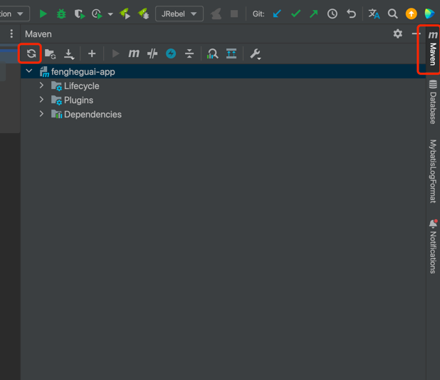
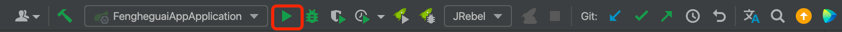
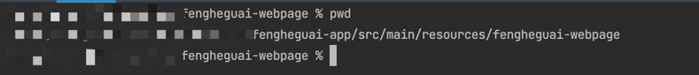
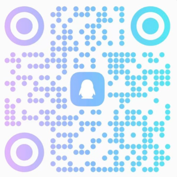

### 启动

1. 配置好Maven，下载依赖
    
2. 依赖下载完成后，点击启动后端服务
    
3. terminal切换到"resources/fengheguai-webpage"目录下
   
4. 执行"npm install"安装依赖
5. 依赖安装完成后，执行"yarn dev"启动前端
6. 访问登录页面
   http://localhost:3000/login

### 如遇问题无法解决，请访问本站官网[AI缝合怪](https://bsdsma.com)寻求解决

### 各平台教程参考

